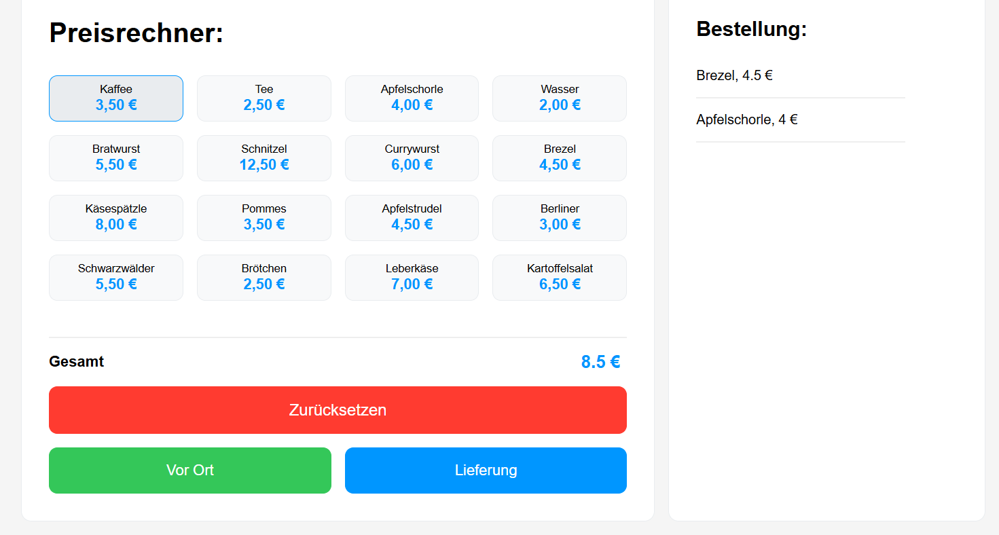

# Preisrechner



Eine webbasierte Kassen- und Preiskalkulations-Anwendung für Gastronomiebetriebe. Die Anwendung ermöglicht es, Speisen und Getränke über eine interaktive Benutzeroberfläche auszuwählen, zu einer Bestellliste hinzuzufügen und den Gesamtpreis basierend auf der gewünschten Serviceart zu berechnen.

## Funktionen

* **Interaktives Bestellmenü:** Auswahl aus 16 vordefinierten Speisen und Getränken per Mausklick.
* **Dynamische Bestellliste:** Fortlaufende Auflistung der ausgewählten Artikel inklusive Einzelpreisen im rechten Bildschirmbereich.
* **Echtzeit-Preiskalkulation:** Automatische Aufsummierung der Einzelpreise zu einem Gesamtbetrag bei jedem Klick.
* **Serviceoptionen:** Getrennte Abrechnungsmethoden für den Verzehr vor Ort oder per Lieferung inklusive Mindestbestellwert-Prüfung und Liefergebühr.
* **Validierte Zurücksetz-Funktion:** Leeren der Bestellliste und Zurücksetzen des Gesamtpreises auf den Ausgangswert von 0,00 €, geschützt durch eine Überprüfung auf aktive Bildschirminhalte.

## Layout und Design

Das visuelle Erscheinungsbild basiert auf einem strukturierten, responsiven CSS-Layout mit folgenden Merkmalen:
* **Grid-Systeme:** Das Hauptlayout ist als zweispaltiges Grid (`2fr 1fr`) mit einer maximalen Breite von 1200px umgesetzt. Die Artikelauswahl verwendet ein vierspaltiges Grid (`repeat(4, 1fr)`) mit flexibler Elementanordnung.
* **Farbkodierung:** Primäre Akzente und Preise sind in einem definierten Blauton (`rgb(0, 150, 255)`) gehalten. Die Aktionsschaltflächen sind farblich nach Funktion getrennt: Rot für das Zurücksetzen, Grün für die Option „Vor Ort“ und Blau für „Lieferung“.
* **Interaktive Effekte:** Die Artikelschaltflächen reagieren auf Mausberührung mit einem Rahmenwechsel und auf Klick mit einer vollständigen Farbumkehr zur visuellen Bestätigung. Die Steuerungsschaltflächen nutzen eine Abdunklung via Helligkeitsfilter beim Darüberfahren.

## Technische Funktionsweise (JavaScript)

Die Anwendungslogik wird über eine zentrale Statusvariable (`count`) gesteuert und umfasst folgende Kernkomponenten:

### Artikel hinzufügen und berechnen
Beim Klick auf ein Produkt wird die Funktion `addPrice(name, price)` aufgerufen. Diese addiert den numerischen Wert des Artikels zur Gesamtsumme, übergibt die Daten an die Bestellliste (`showOrder`) und aktualisiert die Benutzeroberfläche über `displayTotalPrice`. Die Einträge in der Bestellliste werden dynamisch als HTML-Absatzstrukturen (`<p>`) generiert.

### Validierung und Bestellabschluss
Sämtliche Kassenaktionen prüfen initial, ob der aktuelle Rechnungsbetrag größer als 0 ist. Ist dies nicht der Fall, wird die Aktion blockiert und eine Fehlermeldung per Browser-Alert ausgegeben.

* **Option „Vor Ort“:** Die Funktion `payOnSite()` gibt den aktuellen Gesamtbetrag aus und leitet die Daten nach der Bestätigung an die Bereinigungsfunktion weiter.
* **Option „Lieferung“:** Die Funktion `payDelivery()` implementiert eine zweistufige Validierung:
  1. Es wird geprüft, ob ein logischer Mindestbestellwert von 20,00 € erreicht wurde. Bei Unterschreitung wird der Vorgang abgebrochen.
  2. Bei erfolgreicher Prüfung wird eine pauschale Liefergebühr von 2,50 € auf die Variable `count` addiert.
  3. Die finale Abrechnung erfolgt zeitverzögert über ein `setTimeout` (10 Millisekunden), um sicherzustellen, dass die Aktualisierung des Gesamtpreises im DOM visuell abgeschlossen ist, bevor die Benachrichtigung den Thread blockiert.

### Bereinigung
Die Funktion `reset()` entfernt alle dynamisch erzeugten HTML-Elemente aus dem Container `#order-list`, setzt die Statusvariable `count` auf den numerischen Wert `0` zurück und aktualisiert die Anzeige.

## Aufbau der Benutzeroberfläche

Die Anwendung teilt den Bildschirm in zwei funktionale Hauptbereiche:
* **Linker Bereich (`.left-element`):** Enthält das Raster mit den Artikelschaltflächen, die Preisanzeige für den Gesamtbetrag sowie die Steuerungselemente zur Bestellabwicklung.
* **Rechter Bereich (`.right-element`):** Dient als dynamischer, vertikal scrollbarer Container (`#order-list`) für die visuelle Darstellung der aktuellen Bestellung.

## Installation und Start

1. Klonen des Repositorys oder Herunterladen der Projektdateien:
   ```bash
   git clone https://github.com
   ```
2. Sicherstellen der korrekten Verzeichnisstruktur im Zielordner:
   ```text
   ├── images/
   │   └── previewPreisrechner.png
   ├── index.html
   ├── index.css
   └── index.js
   ```
3. Ausführen der Anwendung:
   * Die Datei `index.html` per Doppelklick in einem aktuellen Webbrowser öffnen. Ein lokaler Server oder Build-Prozess ist nicht erforderlich.
